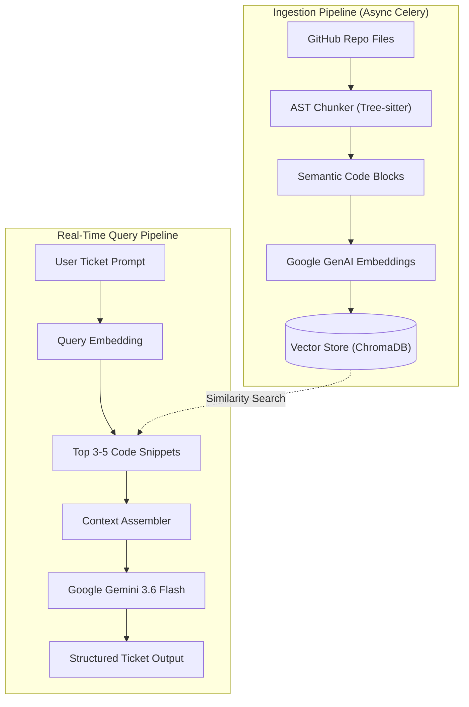
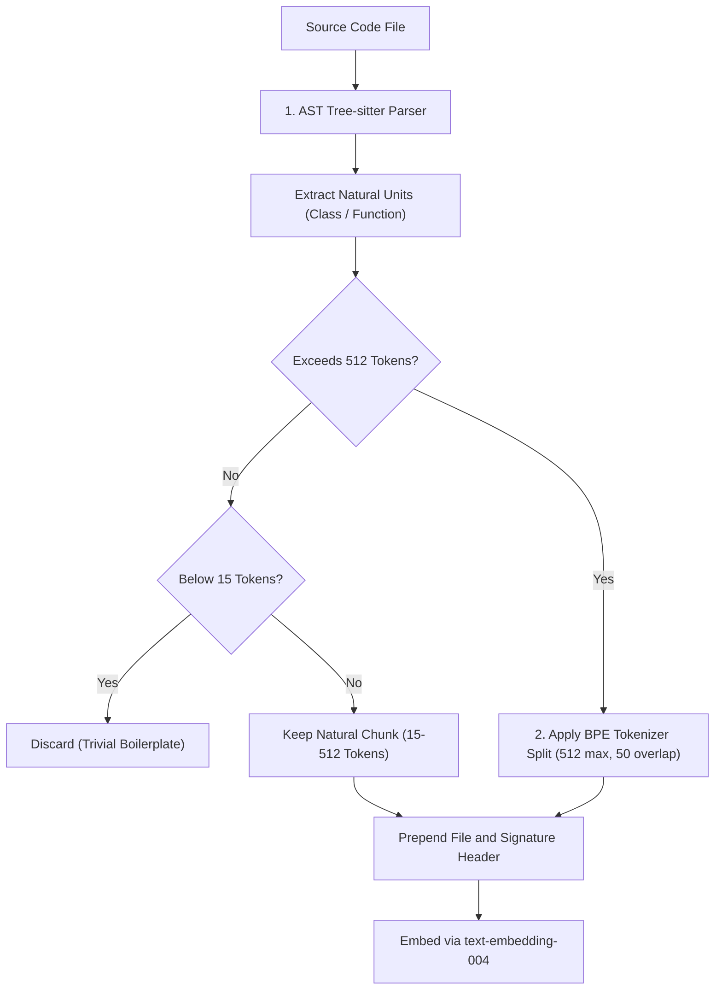

# 🧠 Architectural Design & Implementation Plan: Codebase RAG Pipeline

This document outlines the end-to-end architecture, data schemas, embedding strategy, and retrieval pipeline for upgrading the AI task generation system from static AST outlines to a **Full Retrieval-Augmented Generation (RAG)** pipeline.

---

## 📌 Executive Summary

Currently, the platform extracts a high-level symbol outline (function and class names) via Tree-sitter. While this gives the LLM high-level awareness of repo structure, it lacks actual implementation logic, variable signatures, docstrings, and cross-file dependencies.

With **Codebase RAG**, the system will:
1. **Parse & Chunk** the entire codebase semantically (by AST function/class blocks).
2. **Embed** each chunk into vector space using Google's `text-embedding-004` (via `google.genai`).
3. **Index & Store** vectors in a dedicated vector store (e.g. `ChromaDB` or `pgvector` / `sqlite-vec`).
4. **Retrieve & Rerank** the top 3–5 most relevant code snippets based on the user's natural language ticket prompt.
5. **Synthesize** a high-fidelity prompt combining both the high-level AST tree and the retrieved code chunks.

---

## 🌿 Git Branching Recommendation

### **Should you use a new Git branch?**
👉 **YES, absolutely.**

```bash
git checkout -b feature/codebase-rag-pipeline
```

### Why this is critical:
1. **Isolated Architectural Evolution:** RAG introduces new models (`CodeChunk`, `ProjectIndex`), vector dependencies (`chromadb` / `pgvector`), background Celery indexing tasks, and modified prompt formatting.
2. **A/B Testing & Evaluation:** A separate branch lets you benchmark ticket quality between:
   - *Baseline:* Static Tree-sitter AST outline.
   - *RAG Only:* Top-K raw code embeddings.
   - *Hybrid:* AST Outline + Top-K Detailed Chunks.
3. **Zero Downtime for Existing Features:** Your current working Docker containers, 2FA auth, calendar sync, and Celery beat tasks remain completely unaffected.

---

## 🏗️ End-to-End RAG Architecture



---

## 🧩 Step-by-Step Implementation Roadmap

### Phase 1: AST-Aware Semantic Code Chunking + BPE Token Guardrails

> ⚠️ **Why Fixed/Equal Token Splitting Fails for Code:** Forcing chunks into identical token sizes cuts functions mid-syntax and merges unrelated classes together, polluting vector embeddings. Code must be chunked along natural **AST boundaries** with **BPE token guardrails** as upper/lower ceilings.

#### 1. Primary Strategy: AST Structural Units
Use **Tree-sitter** to extract natural semantic blocks:
- Standalone **functions / methods** (1 chunk per function).
- **Data models & class declarations** (1 chunk per class).
- Top-level module configuration / routers.

#### 2. Secondary Strategy: BPE Token Guardrails
- **Minimum Floor (< 15 tokens):** Ignore trivial boilerplate (`pass`, empty stubs).
- **Normal Range (15 – 512 tokens):** Kept as intact, variable-length semantic units.
- **Maximum Ceiling (> 512 tokens):** If a single function is monolithic, use a **BPE tokenizer** (`tiktoken` / subword tokenizer) to split *only that oversized function* into smaller slices with a **15% token overlap**.



#### Chunk Structure & Context Headers:
Each chunk is prefixed with contextual metadata headers before embedding:
```text
File: src/auth/service.py
Class: AuthService
Function: authenticate_user(username, password)
Lines: 42-68
----------------------------------------
def authenticate_user(username, password):
    user = User.objects.filter(username=username).first()
    if user and user.check_password(password):
        return generate_tokens(user)
    raise AuthenticationFailed("Invalid credentials")
```

#### BPE Guardrail Code Implementation:
```python
import tiktoken

# Use standard OpenAI or Google subword BPE encoding
tokenizer = tiktoken.get_encoding("cl100k_base")

def get_token_count(text: str) -> int:
    return len(tokenizer.encode(text))

def chunk_with_bpe_guardrails(code_blocks: list[dict], max_tokens: int = 512, overlap: int = 64) -> list[dict]:
    final_chunks = []
    
    for block in code_blocks:
        token_count = get_token_count(block["code"])
        
        # 1. Floor guardrail: ignore trivial 1-line stubs
        if token_count < 15:
            continue
            
        # 2. Ideal natural semantic block
        if token_count <= max_tokens:
            final_chunks.append(block)
        else:
            # 3. Ceiling guardrail: split oversized function using BPE token sliding window
            tokens = tokenizer.encode(block["code"])
            start = 0
            slice_index = 1
            while start < len(tokens):
                end = min(start + max_tokens, len(tokens))
                slice_code = tokenizer.decode(tokens[start:end])
                
                final_chunks.append({
                    "filepath": block["filepath"],
                    "symbol_name": f"{block['symbol_name']} (part {slice_index})",
                    "start_line": block["start_line"],
                    "end_line": block["end_line"],
                    "code": slice_code,
                })
                
                if end == len(tokens):
                    break
                start += max_tokens - overlap
                slice_index += 1
                
    return final_chunks
```

---

### Phase 2: Vector Storage Strategy

#### Option A: Lightweight Embedded Vector Store — **ChromaDB** *(Recommended)*
- **Pros:** Runs directly inside Python or as a dedicated container in `compose.yml`; persistent on disk; built-in cosine/L2 distance search; zero PostgreSQL migration overhead.
- **Docker Compose addition:**
  ```yaml
  chromadb:
    image: chromadb/chroma:latest
    ports:
      - "8000:8000"
    volumes:
      - chroma_data:/chroma/chroma
  ```

#### Option B: Relational + Vector Extension — **`pgvector`** or **`sqlite-vec`**
- Store embeddings directly alongside Django models in SQLite or PostgreSQL.

---

### Phase 3: Embedding Generation with Google GenAI

Since you already use `google.genai` (`gemini-3.6-flash`), you can use Google's state-of-the-art code embedding model: **`text-embedding-004`**.

```python
from google import genai

client = genai.Client()

def embed_text(text: str) -> list[float]:
    response = client.models.embed_content(
        model="text-embedding-004",
        contents=text,
    )
    return response.embedding.values
```

---

### Phase 4: Database Models & Celery Background Indexing

Add indexing tracking in [`coresite/models.py`](file:///Users/omar/Documents/django-test/coresite/models.py):

```python
class Project(models.Model):
    # Existing fields...
    is_indexed = models.BooleanField(default=False)
    last_indexed_at = models.DateTimeField(null=True, blank=True)
    collection_name = models.CharField(max_length=100, blank=True)
```

In [`coresite/tasks.py`](file:///Users/omar/Documents/django-test/coresite/tasks.py), create an async Celery task so indexing large repositories never blocks the web thread:

```python
@shared_task
def index_project_codebase(project_id: int):
    project = Project.objects.get(id=project_id)
    # 1. Fetch file tree from GitHub
    # 2. Extract AST semantic chunks
    # 3. Batch embed chunks using text-embedding-004
    # 4. Upsert into ChromaDB collection `project_{project_id}`
    # 5. project.is_indexed = True; project.save()
```

---

### Phase 5: Query Retrieval & Prompt Synthesis

When a user calls `POST /api/tasks/gen/`:

```python
def retrieve_relevant_code(project: Project, query_text: str, top_k: int = 4) -> str:
    # 1. Generate query embedding
    query_vector = embed_text(query_text)
    
    # 2. Search ChromaDB collection
    collection = chroma_client.get_collection(f"project_{project.id}")
    results = collection.query(
        query_embeddings=[query_vector],
        n_results=top_k
    )
    
    # 3. Format matches into prompt context
    retrieved_snippets = []
    for doc, metadata in zip(results['documents'][0], results['metadatas'][0]):
        retrieved_snippets.append(
            f"--- Snippet from {metadata['filepath']} (Lines {metadata['start_line']}-{metadata['end_line']}) ---\n"
            f"{doc}\n"
        )
    
    return "\n\n".join(retrieved_snippets)
```

---

### Phase 6: The "Hybrid Prompt" (AST Outline + RAG Snippets)

The final prompt passed to Gemini combines **macro-structure (AST)** and **micro-implementation (RAG)**:

```text
You are a Principal Software Architect generating an engineering ticket.

--- HIGH-LEVEL REPOSITORY OUTLINE (MACRO CONTEXT) ---
File: coresite/models.py
  class Project
  class Task
  class EmailOTP
File: coresite/views/auth_views.py
  class Login2FAView()
  class Verify2FAView()
------------------------------------------------------

--- RELEVANT CODE IMPLEMENTATION SNIPPETS (MICRO CONTEXT) ---
[Snippet 1: coresite/models.py (Lines 84-124)]
class EmailOTP(models.Model):
    user = models.ForeignKey(User, on_delete=models.CASCADE)
    otp_code = models.CharField(max_length=6)
    session_token = models.CharField(max_length=64, unique=True)
    ...

[Snippet 2: coresite/views/auth_views.py (Lines 73-118)]
class Login2FAView(APIView):
    def post(self, request):
        serializer = Login2FASerializer(data=request.data)
        ...
-------------------------------------------------------------

USER REQUEST:
Add an endpoint that validates whether an active OTP session token is still valid before loading the verification screen.

INSTRUCTIONS:
1. Examine the actual method implementations in the retrieved snippets above.
2. Reference the exact class attributes and method signatures.
3. Output the structured JSON ticket with specific step-by-step subtasks.
```

---

## 📊 Summary of Benefits Over AST-Only

| Capability | Current AST Outline | Proposed RAG Architecture |
| :--- | :--- | :--- |
| **Context Window Size** | Struggles with 50+ files | Scales to thousands of files seamlessly |
| **Logic Visibility** | Sees only names (`def login()`) | Sees actual code, queries, exceptions, & models |
| **Prompt Relevance** | Sends entire symbol tree blindly | Injects only the 3–5 most relevant code blocks |
| **Ticket Accuracy** | Estimates dependencies | Writes exact code edits matching real signatures |
