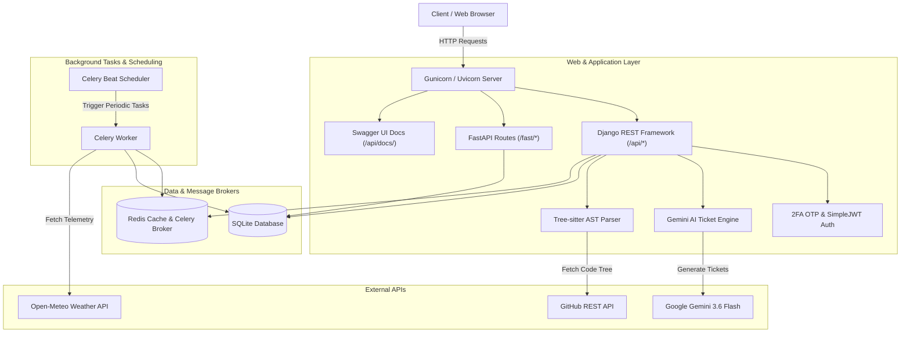
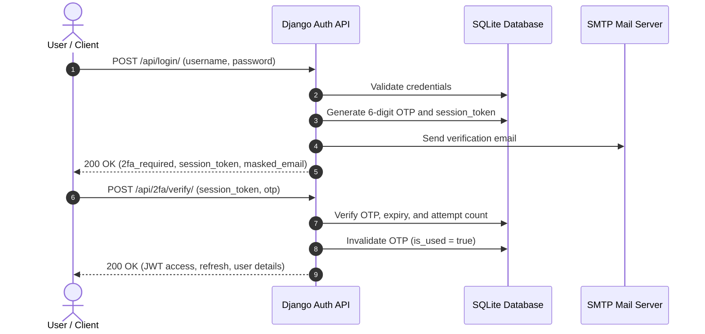
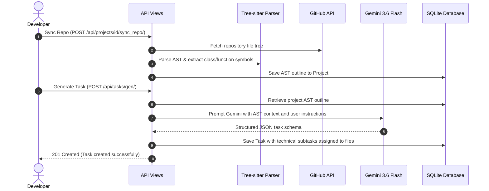

# 🚀 AI-Powered Task & Repository Intelligence Platform

A modern, full-stack developer task management and ticket intelligence platform built with **Django 6.0**, **Django REST Framework (DRF)**, **FastAPI (ASGI hybrid)**, **Celery 5.6**, **Redis**, **Tree-sitter AST parsing**, and **Google Gemini 3.6 Flash**.

The platform bridges codebases and project management by extracting repository structure outlines (AST) directly from GitHub and using Generative AI to produce actionable, context-aware engineering tickets with step-by-step subtasks, deadlines, and file references.

---

## 🌟 Key Highlights

- **🧠 Context-Aware AI Ticket Generation:** Translates plain English ideas or bug reports into structured engineering tickets referencing existing classes, functions, and files parsed from the linked GitHub repository.
- **🌳 Multi-Language AST Parsing:** Uses **Tree-sitter** (Python, JavaScript, JSX, TypeScript, TSX) to recursively parse repository trees, extract code symbol outlines, and feed them into LLM prompt contexts.
- **🔐 Secure 2FA Authentication Flow:** Two-step login with 6-digit email OTP (5-minute expiry, rate-limited attempts, session tokens, email masking) + JWT tokens (`djangorestframework-simplejwt`).
- **⚡ Dual-Engine API Architecture:** Standard Django REST Framework endpoints alongside high-performance **FastAPI** ASGI routes sharing the same Django ORM.
- **⏰ Asynchronous Background Tasks & Cron:** Periodic weather telemetry and database pruning powered by **Celery Beat**, **Celery Worker**, and **Redis**.
- **📖 Interactive OpenAPI 3.0 Documentation:** Fully typed Swagger UI documentation powered by `drf-spectacular`.
- **🎨 Sleek SPA Frontend:** Responsive dark-mode interface with live project filtering, expandable subtask checklists, AST inspector modals, and weather telemetry.

---

## 🏗️ Architecture Overview



---

## 🛠️ Technology Stack

| Layer | Technologies |
| :--- | :--- |
| **Backend Frameworks** | Django 6.0, Django REST Framework 3.17, FastAPI 0.111 (ASGI) |
| **Authentication & Security** | SimpleJWT 5.5, Email OTP 2FA, Anon/User Throttling, Password Hashing |
| **AI / LLM Engine** | Google GenAI SDK (`gemini-3.6-flash`), Structured JSON Output Validation |
| **Code Intelligence** | Tree-sitter (Python, JavaScript, TypeScript, TSX) |
| **Async Tasks & Queues** | Celery 5.6, Celery Beat, Redis 8.0, django-redis 7.0 |
| **API Documentation** | drf-spectacular (OpenAPI 3.0+, Swagger UI) |
| **Data Validation** | Pydantic v2 (`schemas.py`), DRF Serializers |
| **Frontend** | Vanilla HTML5 / ES6 JavaScript / CSS3 (Sterile Dark Theme, Inter font) |
| **DevOps & Containerization** | Docker, Docker Compose, Gunicorn, Uvicorn |

---

## 📂 Project Directory Structure

```text
├── .env                         # Environment variables (secrets, tokens, keys)
├── .gitignore                   # Comprehensive Git ignore rules
├── Dockerfile                   # Multi-stage Python 3.14-slim container definition
├── compose.yml                  # Docker Compose orchestration (web, redis, worker, beat)
├── manage.py                    # Django management script
├── main.py                      # FastAPI ASGI application mounted with Django
├── schemas.py                   # Pydantic schemas for data validation and LLM output
├── mypy.ini                     # Type checker configuration
├── requirements.txt             # Project dependencies
├── staticfiles/                 # Collected static assets
│
├── myproject/                   # Django Project Configuration
│   ├── __init__.py
│   ├── asgi.py                  # ASGI entrypoint
│   ├── celery.py                # Celery app initialization and autodiscovery
│   ├── settings.py              # Global settings, DRF, Spectacular, Redis, JWT
│   ├── urls.py                  # Root URL routing, Swagger UI endpoints
│   └── wsgi.py                  # WSGI entrypoint
│
└── coresite/                    # Main Core Application
    ├── admin.py                 # Django Admin configuration with Import/Export
    ├── apps.py                  # App configuration
    ├── models.py                # Database models (Project, Task, Weather, EmailOTP)
    ├── serializers.py           # DRF Serializers with custom validators
    ├── urls.py                  # App-level routing and viewset routers
    ├── tasks.py                 # Celery shared tasks (Weather polling & cleanup)
    │
    ├── views/                   # Modular API Views
    │   ├── __init__.py          # Clean module exports
    │   ├── auth_views.py        # 2FA Login, OTP Verification, Resend, Register, Throttle
    │   └── task_views.py        # TaskViewSet (CRUD + AI gen), ProjectViewSet (AST sync), Users
    │
    ├── services/                # Business Logic Services
    │   ├── github_parser.py     # Tree-sitter AST extraction from GitHub repositories
    │   └── utils.py             # Gemini LLM prompt execution, weather code mapping
    │
    └── templates/
        └── tasks.html           # Live interactive Single Page Application (SPA)
```

---

## 🗄️ Data Models & Database Schema

### 1. `Project`
Represents a software project linked to an optional GitHub repository.
- `name` (CharField): Name of the project.
- `github_repo` (CharField): Target repository (e.g. `octocat/Hello-World`).
- `ast_outline` (TextField): Cached AST symbol outline extracted by Tree-sitter.
- `github_token` (CharField): Personal Access Token for private repository access.
- `owner` (ForeignKey -> `User`): Project creator and owner.

### 2. `Task`
Represents an engineering ticket or task.
- `title` (CharField): Summary title of the ticket.
- `description` (CharField): Detailed technical implementation guidelines.
- `ticket_type` (CharField): Choice of `feature`, `bug`, or `chore`.
- `completed` (BooleanField): Completion status.
- `due_date` (DateTimeField): Optional deadline with timezone offset.
- `subtasks` (JSONField): Array of subtasks (`[{"title": "...", "completed": false}]`).
- `project` (ForeignKey -> `Project`): Optional associated project.
- `owner` (ForeignKey -> `User`): Task owner.

### 3. `EmailOTP`
Manages Two-Factor Authentication codes.
- `user` (ForeignKey -> `User`): Targeted user account.
- `otp_code` (CharField): 6-digit cryptographically secure verification code.
- `session_token` (CharField): Unique UUID session identifier.
- `expires_at` (DateTimeField): Expiration timestamp (default: 5 minutes).
- `attempts` (IntegerField): Failed verification attempts counter (max 5).
- `is_used` (BooleanField): Status flag to prevent replay attacks.

### 4. `UserProfile`
Stores user settings and private subscription tokens for external calendar integrations.
- `user` (OneToOneField -> `User`): Targeted user account.
- `calendar_token` (CharField): Private 64-character token used for authenticating `.ics` feed subscriptions.
- `created_at` (DateTimeField): Timestamp when profile was created.

### 5. `Weather`
Stores scheduled weather records for dashboard telemetry.
- `temp` (FloatField): Temperature in Celsius.
- `time` (DateTimeField): Measurement timestamp.
- `weather` (CharField): Human-readable weather description.
- `weather_code` (IntegerField): WMO weather code from Open-Meteo.

---

## 🚀 Key Workflows

### 1. Two-Factor Authentication Flow (2FA)



### 2. GitHub AST Parsing & AI Ticket Generation



---

## 📡 API Reference

### 🔐 Authentication (`/api/`)

| Method | Endpoint | Description | Request Body |
| :--- | :--- | :--- | :--- |
| `POST` | `/api/register/` | Register new account and receive JWT tokens | `{"username", "email", "password"}` |
| `POST` | `/api/login/` | Step 1: Validate credentials & trigger 2FA OTP email | `{"username", "password"}` |
| `POST` | `/api/2fa/verify/` | Step 2: Verify 6-digit OTP and receive JWT tokens | `{"session_token", "otp"}` |
| `POST` | `/api/2fa/resend/` | Resend new OTP code using active session token | `{"session_token"}` |
| `POST` | `/api/token/` | Direct JWT token obtain (bypasses 2FA, throttled) | `{"username", "password"}` |
| `POST` | `/api/token/refresh/` | Refresh expired JWT access token | `{"refresh"}` |

### 📅 Calendar & Reminders Sync (`/api/calendar/`)

| Method | Endpoint | Description | Auth Required |
| :--- | :--- | :--- | :--- |
| `GET` | `/api/calendar/feed/<token>.ics` | Public iCalendar (`.ics`) feed for Google / Apple Calendar | No (URL Token) |
| `GET` | `/api/calendar/token/` | Get authenticated user's private feed and webcal URLs | Yes (JWT) |
| `POST` | `/api/calendar/token/refresh/` | Invalidate previous URL and generate a new private token | Yes (JWT) |

### 📋 Tasks (`/api/tasks/`)

| Method | Endpoint | Description |
| :--- | :--- | :--- |
| `GET` | `/api/tasks/` | List all tasks for authenticated user |
| `POST` | `/api/tasks/` | Create a new task manually |
| `GET` | `/api/tasks/{id}/` | Retrieve task details |
| `PUT` / `PATCH` | `/api/tasks/{id}/` | Full or partial update of a task |
| `DELETE` | `/api/tasks/{id}/` | Delete a task (triggers post-delete signal) |
| `POST` | `/api/tasks/gen/` | **AI Generation**: Generate task with Gemini from text |

### 📂 Projects (`/api/projects/`)

| Method | Endpoint | Description |
| :--- | :--- | :--- |
| `GET` | `/api/projects/` | List user projects |
| `POST` | `/api/projects/` | Create a project (auto-triggers initial AST sync) |
| `GET` | `/api/projects/{id}/` | Retrieve project details and cached AST outline |
| `DELETE` | `/api/projects/{id}/` | Delete project and cascade tasks |
| `POST` | `/api/projects/{id}/sync_repo/` | Manually sync/refresh AST outline from GitHub |

### ⚡ FastAPI Endpoints (`/fast/`)

| Method | Endpoint | Description |
| :--- | :--- | :--- |
| `GET` | `/fast/tasks` | High-performance fetch of all tasks |
| `POST` | `/fast/tasks/` | Create task via FastAPI route |
| `GET` | `/fast/tasks/{task_id}` | Retrieve specific task |
| `PUT` | `/fast/tasks/{task_id}` | Update task |
| `DELETE` | `/fast/tasks/{task_id}` | Delete task |

### 📖 Documentation & Schema

| URL | Description |
| :--- | :--- |
| `http://127.0.0.1:8000/api/docs/` | **Interactive Swagger UI** |
| `http://127.0.0.1:8000/api/schema/` | Raw OpenAPI 3.0 YAML/JSON Schema |
| `http://127.0.0.1:8000/interface/` | Live Web Application UI (SPA) |

---

## ⚙️ Environment Variables Configuration

Create a `.env` file in the project root directory:

```env
# Django Settings
SECRET_KEY=your-super-secret-django-key
DEBUG=True
ALLOWED_HOSTS=*

# Google Gemini API (Required for AI task generation)
GEMINI_API_KEY=AIzaSy...your-gemini-api-key

# Redis & Celery
REDIS_URL=redis://redis:6379/1

# Email / 2FA SMTP Configuration
EMAIL_HOST=smtp.gmail.com
EMAIL_PORT=587
EMAIL_USE_TLS=True
EMAIL_HOST_USER=your-email@gmail.com
EMAIL_HOST_PASSWORD=your-app-password
DEFAULT_FROM_EMAIL=your-email@gmail.com
```

---

## 🚀 Getting Started & Execution

### Option A: Using Docker Compose (Recommended)

Docker Compose automatically spins up the **Web App (Gunicorn/Django)**, **Redis Cache/Broker**, **Celery Worker**, and **Celery Beat**:

```bash
# 1. Build and start all services in the background
docker compose up --build -d

# 2. View running containers
docker compose ps

# 3. View live logs
docker compose logs -f web celery_worker
```

Open your browser:
- **Web App UI:** [http://127.0.0.1:8000/api/interface/](http://127.0.0.1:8000/api/interface/)
- **Swagger Documentation:** [http://127.0.0.1:8000/api/docs/](http://127.0.0.1:8000/api/docs/)
- **Django Admin:** [http://127.0.0.1:8000/admin/](http://127.0.0.1:8000/admin/)

---

### Option B: Local Native Setup

#### 1. Create and Activate Virtual Environment
```bash
python3 -m venv venv
source venv/bin/activate
```

#### 2. Install Dependencies
```bash
pip install -r requirements.txt
```

#### 3. Run Migrations & Collect Static Files
```bash
python manage.py migrate
python manage.py collectstatic --noinput
```

#### 4. Create Superuser (Optional)
```bash
python manage.py createsuperuser
```

#### 5. Start Redis
```bash
redis-server
```

#### 6. Start Celery Worker & Celery Beat (in separate terminal tabs)
```bash
# Tab 1: Celery Worker
celery -A myproject worker -l INFO

# Tab 2: Celery Beat Scheduler
celery -A myproject beat -l INFO
```

#### 7. Run Web Server
```bash
# Option 1: Standard Django development server
python manage.py runserver 127.0.0.1:8000

# Option 2: FastAPI + Django ASGI server
uvicorn main:app --host 127.0.0.1 --port 8000 --reload
```

---

## 🧪 Testing & Validation

```bash
# Run pytest suite
pytest

# Run pytest with terminal code coverage report
pytest --cov=coresite --cov-report=term-missing

# Generate HTML code coverage report (saved to htmlcov/index.html)
pytest --cov=coresite --cov-report=html

# Validate OpenAPI schema generation
python manage.py spectacular --validate --file /dev/null

# Run type checker
mypy coresite/
```

### 🔍 VS Code Testing Panel
Tests can also be discovered, executed, and debugged directly in the VS Code **Testing** side panel (`pytest` is configured in `.vscode/settings.json`).


---

## 🔒 Security Best Practices Implemented

- **Rate Limiting (Throttling):** Authentication endpoints (`RegisterView`, `Login2FAView`, `Verify2FAView`, `Resend2FAView`, `ThrottledTokenObtainPairView`) enforce strict rate limits (`5/minute` for anon users).
- **2FA Expiration & Single-Use:** OTP codes expire in 5 minutes, enforce a maximum of 5 attempts, and are instantly invalidated upon successful verification.
- **Email Masking:** Emails returned in responses are masked (e.g. `om***@gmail.com`) to prevent exposure.
- **Safe Swagger Queryset Fallbacks:** Uses `swagger_fake_view` checks in `get_queryset()` to prevent unauthenticated data leakage or crashes during schema inspection.
- **Secrets Isolation:** All credentials, tokens, and keys are loaded through `.env` with strict exclusions in `.gitignore`.
