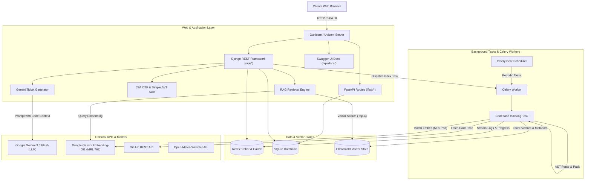

# 🚀 AI-Powered Task & Repository Intelligence Platform

A modern, full-stack developer task management and ticket intelligence platform built with **Django 6.0**, **Django REST Framework (DRF)**, **FastAPI (ASGI hybrid)**, **Celery 5.6**, **Redis**, **Tree-sitter AST parsing**, **ChromaDB Vector Store**, and **Google Gemini 3.6 Flash & Embedding-001**.

The platform bridges codebases and project management by extracting repository structure outlines (AST) and deep semantic vector embeddings directly from GitHub, enabling Generative AI to produce actionable, context-aware engineering tickets with step-by-step subtasks, deadlines, and file references.

---

## 🌟 Key Highlights

- **🧠 Context-Aware AI Ticket Generation:** Translates plain English ideas or bug reports into structured engineering tickets referencing existing classes, functions, and files parsed from the linked GitHub repository.
- **🔍 Deep Semantic Code-RAG Search:** Powered by **ChromaDB** and **Google Gemini Embedding-001**, enabling semantic vector search across all functions, classes, and interfaces in linked repositories.
- **🌳 Multi-Language AST Parsing & Elastic Chunk Packing:** Uses **Tree-sitter** (Python, JavaScript, JSX, TypeScript, TSX, Java) combined with a zero-loss **AST Chunk Packing Engine** with elastic soft limits ($250 - 350$ token target window, up to $750$ token intact ceiling, tail stitching, and enclosing class header preservation).
- **⚡ Matryoshka Dimension Optimization (MRL 768):** Leverages Gemini's Matryoshka Representation Learning to compress embeddings to 768 dimensions—slashing RAM and disk storage by **75%** while accelerating vector similarity calculations by **4x** with $>98.5\%$ retrieval accuracy.
- **📊 Real-Time Repository Sync Activity Drawer:** Slide-out drawer with animated progress bar, 5-stage live status checklist, rolling dark-mode terminal logs, and Redis task polling.
- **🔐 Secure 2FA Authentication Flow:** Two-step login with 6-digit email OTP (5-minute expiry, rate-limited attempts, session tokens, email masking) + JWT tokens (`djangorestframework-simplejwt`).
- **⚡ Dual-Engine API Architecture:** Standard Django REST Framework endpoints alongside high-performance **FastAPI** ASGI routes sharing the same Django ORM.
- **⏰ Asynchronous Background Tasks & Cron:** Background repository indexing and periodic weather telemetry powered by **Celery Worker**, **Celery Beat**, and **Redis**.
- **📖 Interactive OpenAPI 3.0 Documentation:** Fully typed Swagger UI documentation powered by `drf-spectacular`.

---

## 🏗️ Architecture Overview



---

## 🔬 Deep-Dive: Code-RAG & AST Chunk Packing Engine

Traditional RAG chunkers split code arbitrarily every $N$ characters or tokens, causing broken syntax trees, severed class scopes, and hundreds of fragmented 1-line stubs. Our engine solves this with a **multi-stage AST chunk packing and embedding pipeline**:

```
GitHub Repository
   │
   ▼
[1. Filter & Discovery] ────────► Excludes tests (*Test.java, test/), docs, build dirs
   │
   ▼
[2. Tree-sitter AST Parsing] ────► Extracts complete classes, functions, records, interfaces
   │
   ▼
[3. Enclosing Class Binding] ───► Injects 'Class: Declaration' header into method chunks
   │
   ▼
[4. Elastic AST Chunk Packing] ──► Packs contiguous methods (250-350 tok), tail stitching (<=750 tok)
   │
   ▼
[5. MRL 768 Batch Embedding] ───► 1 HTTP batch to gemini-embedding-001 with 768-dim output
   │
   ▼
[6. ChromaDB Vector Store] ─────► Indexed with start/end lines, filepath, and symbol types
```

---

### 1. The Elastic Limits Architecture (`ChunkingConfig`)

To maximize semantic retrieval while strictly respecting API quotas and embedding token boundaries, chunking decisions are regulated by pure boolean evaluation helpers:

| Tier / Rule | Nominal Target | Elastic Window | Hard Barrier | Exact Action & Behavior |
| :--- | :--- | :--- | :--- | :--- |
| **Method Accumulation** | **300 tokens** | **$250 - 350$ tokens** | $750$ tokens | Contiguous methods accumulate until $\ge 250$ tokens. If buffer is $< 250$, absorbs up to $750$ tokens to prevent an orphan fragment. |
| **Intact Class Preservation** | **650 tokens** | **Up to $750$ tokens** | $750$ tokens | Classes up to **750 tokens** (fields, constructor, methods) stay unified as 1 intact chunk. |
| **Standalone Intact Function** | **650 tokens** | **Up to $750$ tokens** | $750$ tokens | Functions up to **750 tokens** stay 100% whole without artificial BPE slicing. |
| **End-of-File Tail Stitching** | Leftover ($< 250$) | **Combined $\le 750$** | $750$ tokens | If previous chunk + leftover $\le 750$, stitches into tail of previous chunk. If $> 750$, emits as separate chunk. |
| **Pre-Massive Function Isolation** | Preceding Buffer | Standalone Chunk | $750$ tokens | Any function/buffer preceding a massive algorithm ($> 750$) is always emitted as its own clean chunk to ensure 100% cache isolation on re-syncs. |
| **Massive Function Slicing** | **512 tokens** | 64-token overlap | $512$ tokens / slice | Genuine algorithm monsters ($> 750$ tokens) are sliced into overlapping $512$-token pieces. |
| **API Model Barrier** | N/A | N/A | **2,048 tokens** | Hard model ceiling guardrail to prevent Google API rejection. |

---

### 2. Enclosing Class Context Preservation

When a class is larger than 750 tokens (or a file contains multiple classes), decomposing by individual methods risks losing class-level identity. 

The chunker extracts the parent class declaration signature via `get_enclosing_class_signature()` and binds it to each method chunk's header:

```
File: src/main/java/com/app/PaymentService.java
Class: public class PaymentService extends BaseService implements IPaymentGateway
Type: Function (Group)
Lines: 45-82
----------------------------------------
public void processTransaction(Transaction tx) {
    validateCard(tx.getCard());
    gateway.charge(tx.getAmount());
}
```

* **Benefit for Vector Search:** Queries searching for `"classes implementing IPaymentGateway"` or `"PaymentService inheritance"` match any method chunk from that class with high similarity.
* **Benefit for LLM Generation:** Gemini receives full parent class context along with the method body.

---

### 3. Google Gemini Embedding-001 & MRL 768 Optimization

Embeddings are generated using **`gemini-embedding-001`** configured with **Matryoshka Representation Learning (MRL)**:

```python
result = genai_client.models.embed_content(
    model="gemini-embedding-001",
    contents=batch_texts,
    config=types.EmbedContentConfig(
        task_type="RETRIEVAL_DOCUMENT",
        output_dimensionality=768,  # <- 768-dim MRL truncation
    ),
)
```

#### Why 768 Output Dimensions?
* **75% Memory & Storage Reduction:** Reduces vector storage from ~12.3 KB (3072 floats) down to **~3.1 KB per chunk** in ChromaDB.
* **4x Faster Search Latency:** Dot-product cosine distance calculations on 768 floats run 4x faster than on 3072 floats.
* **>98.5% Accuracy Retention:** Research on Gemini embeddings confirms that scaling down from 3072 to 768 preserves virtually all semantic retrieval accuracy.
* **Zero Rate-Limit Errors:** Compressing codebases into ~25 dense chunks means an entire repository is embedded in **1 single batch API request**, consuming only **25% of Google's 100 RPM free quota**.

---

## 🛠️ Technology Stack

| Layer | Technologies |
| :--- | :--- |
| **Backend Frameworks** | Django 6.0, Django REST Framework 3.17, FastAPI 0.111 (ASGI) |
| **Vector Database & RAG** | ChromaDB 1.0 (Persistent Vector Store / HTTP Client) |
| **AI / LLM & Embeddings** | Google GenAI SDK (`gemini-3.6-flash`, `gemini-embedding-001` with MRL 768) |
| **Code Intelligence** | Tree-sitter (Python, JavaScript, JSX, TypeScript, TSX, Java), Tiktoken (BPE) |
| **Authentication & Security** | SimpleJWT 5.5, Email OTP 2FA, Anon/User Throttling, Password Hashing |
| **Async Tasks & Queues** | Celery 5.6, Celery Beat, Redis 8.0, django-redis 7.0 |
| **API Documentation** | drf-spectacular (OpenAPI 3.0+, Swagger UI) |
| **Data Validation** | Pydantic v2 (`schemas.py`), DRF Serializers |
| **Frontend** | Vanilla HTML5 / ES6 JavaScript / CSS3 (Dark Theme, Live Activity Drawer) |
| **DevOps & Containerization** | Docker, Docker Compose, Gunicorn, Uvicorn, ChromaDB Server |

---

## 🗄️ Data Models & Database Schema

### 1. `Project`
Represents a software project linked to an optional GitHub repository.
- `name` (CharField): Name of the project.
- `github_repo` (CharField): Target repository (e.g. `octocat/Hello-World`).
- `ast_outline` (TextField): Cached AST symbol outline extracted by Tree-sitter.
- `github_token` (CharField): Personal Access Token for private repository access.
- `owner` (ForeignKey -> `User`): Project creator and owner.

### 2. `Task`
Represents an engineering ticket or task.
- `title` (CharField): Summary title of the ticket.
- `description` (CharField): Detailed technical implementation guidelines.
- `ticket_type` (CharField): Choice of `feature`, `bug`, or `chore`.
- `completed` (BooleanField): Completion status.
- `due_date` (DateTimeField): Optional deadline with timezone offset.
- `subtasks` (JSONField): Array of subtasks (`[{"title": "...", "completed": false}]`).
- `project` (ForeignKey -> `Project`): Optional associated project.
- `owner` (ForeignKey -> `User`): Task owner.

### 3. `EmailOTP`
Manages Two-Factor Authentication codes.
- `user` (ForeignKey -> `User`): Targeted user account.
- `otp_code` (CharField): 6-digit cryptographically secure verification code.
- `session_token` (CharField): Unique UUID session identifier.
- `expires_at` (DateTimeField): Expiration timestamp (default: 5 minutes).
- `attempts` (IntegerField): Failed verification attempts counter (max 5).
- `is_used` (BooleanField): Status flag to prevent replay attacks.

### 4. `UserProfile`
Stores user settings and private subscription tokens for external calendar integrations.
- `user` (OneToOneField -> `User`): Targeted user account.
- `calendar_token` (CharField): Private 64-character token used for authenticating `.ics` feed subscriptions.
- `created_at` (DateTimeField): Timestamp when profile was created.

### 5. `Weather`
Stores scheduled weather records for dashboard telemetry.
- `temp` (FloatField): Temperature in Celsius.
- `time` (DateTimeField): Measurement timestamp.
- `weather` (CharField): Human-readable weather description.
- `weather_code` (IntegerField): WMO weather code from Open-Meteo.

---

## 📡 API Reference

### 🔐 Authentication (`/api/`)

| Method | Endpoint | Description | Request Body |
| :--- | :--- | :--- | :--- |
| `POST` | `/api/register/` | Register new account and receive JWT tokens | `{"username", "email", "password"}` |
| `POST` | `/api/login/` | Step 1: Validate credentials & trigger 2FA OTP email | `{"username", "password"}` |
| `POST` | `/api/2fa/verify/` | Step 2: Verify 6-digit OTP and receive JWT tokens | `{"session_token", "otp"}` |
| `POST` | `/api/2fa/resend/` | Resend new OTP code using active session token | `{"session_token"}` |
| `POST` | `/api/token/` | Direct JWT token obtain (bypasses 2FA, throttled) | `{"username", "password"}` |
| `POST` | `/api/token/refresh/` | Refresh expired JWT access token | `{"refresh"}` |

### 📂 Projects & Codebase RAG (`/api/projects/`)

| Method | Endpoint | Description |
| :--- | :--- | :--- |
| `GET` | `/api/projects/` | List user projects with sync and indexing metadata |
| `POST` | `/api/projects/` | Create a project (auto-dispatches Celery RAG indexing) |
| `GET` | `/api/projects/{id}/` | Retrieve project details, AST outline, and ChromaDB collection status |
| `DELETE` | `/api/projects/{id}/` | Delete project and cascade tasks |
| `POST` | `/api/projects/{id}/sync_repo/` | Trigger Celery background AST parsing & ChromaDB embedding sync |
| `GET` | `/api/projects/{id}/index_status/` | Poll live Celery indexing progress (0-100%), stage, and logs |

### 📋 Tasks (`/api/tasks/`)

| Method | Endpoint | Description |
| :--- | :--- | :--- |
| `GET` | `/api/tasks/` | List all tasks for authenticated user |
| `POST` | `/api/tasks/` | Create a new task manually |
| `GET` | `/api/tasks/{id}/` | Retrieve task details |
| `PUT` / `PATCH` | `/api/tasks/{id}/` | Full or partial update of a task |
| `DELETE` | `/api/tasks/{id}/` | Delete a task |
| `POST` | `/api/tasks/gen/` | **AI Generation**: Retrieves Top-4 relevant codebase vectors and prompts Gemini |

---

## ⚙️ Environment Variables Configuration

Create a `.env` file in the project root directory:

```env
# Django Settings
SECRET_KEY=your-super-secret-django-key
DEBUG=True
ALLOWED_HOSTS=*

# Google Gemini API (Required for LLM task generation & Embeddings)
GEMINI_API_KEY=AIzaSy...your-gemini-api-key

# Redis & Celery
REDIS_URL=redis://redis:6379/1

# ChromaDB Vector Database
CHROMA_HOST=chromadb
CHROMA_PORT=8000

# Email / 2FA SMTP Configuration
EMAIL_HOST=smtp.gmail.com
EMAIL_PORT=587
EMAIL_USE_TLS=True
EMAIL_HOST_USER=your-email@gmail.com
EMAIL_HOST_PASSWORD=your-app-password
DEFAULT_FROM_EMAIL=your-email@gmail.com
```

---

## 🚀 Getting Started with Docker Compose

Docker Compose automatically spins up the **Web App (Gunicorn/Django)**, **ChromaDB Vector Store**, **Redis Broker**, **Celery Worker**, and **Celery Beat**:

```bash
# 1. Build and start all services in the background
docker compose up --build -d

# 2. View running containers
docker compose ps

# 3. View live Celery and Web logs
docker compose logs -f web celery_worker chromadb
```

Open your browser:
- **Web App UI:** [http://127.0.0.1:8000/api/interface/](http://127.0.0.1:8000/api/interface/)
- **Swagger Documentation:** [http://127.0.0.1:8000/api/docs/](http://127.0.0.1:8000/api/docs/)
- **Django Admin:** [http://127.0.0.1:8000/admin/](http://127.0.0.1:8000/admin/)

---

## 🧪 Testing & Validation

The codebase includes a test suite covering authentication, serializers, AST chunk packing, vector embeddings, and Celery tasks:

```bash
# Run full pytest suite (124 tests)
./venv/bin/pytest

# Run pytest with code coverage
./venv/bin/pytest --cov=coresite --cov-report=term-missing
```

---

## 🔒 Security Best Practices Implemented

- **Rate Limiting (Throttling):** Authentication endpoints enforce strict rate limits (`5/minute` for anon users).
- **2FA Expiration & Single-Use:** OTP codes expire in 5 minutes, enforce a maximum of 5 attempts, and are instantly invalidated upon successful verification.
- **Email Masking:** Emails returned in responses are masked (e.g. `om***@gmail.com`) to prevent exposure.
- **Zero Token Hard Limits:** All chunk sizes enforce elastic soft boundaries with hard safety barriers preventing token overflow or API errors.
- **Secrets Isolation:** All credentials, tokens, and keys are loaded through `.env` with strict exclusions in `.gitignore`.
